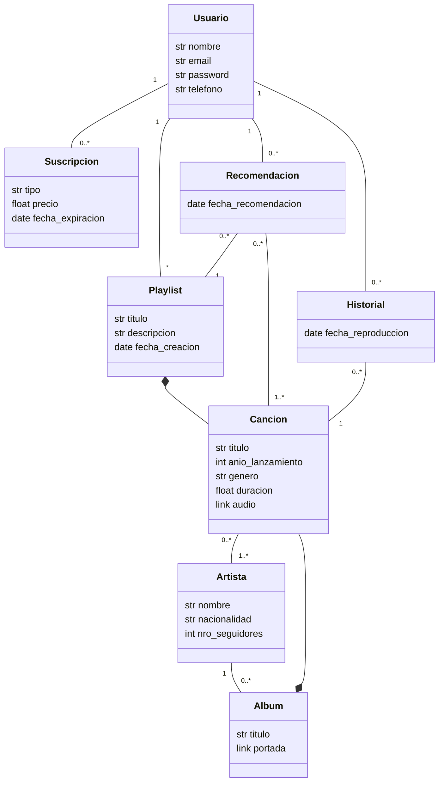

# NOSPEAK - App de streaming de música

## Integrantes

* 47999 - Paolini, Alessandro
* 47844 - Vivas, Facundo Ignacio
* 47800 - Guerra, Bautista
* 47774 - Darder, Fernando

## Descripción del proyecto

El negocio de esta aplicación de streaming de música se centra en ofrecer a los usuarios una plataforma para descubrir, reproducir y gestionar música de forma conveniente y personalizada. La aplicación permite a los usuarios registrarse y acceder a una amplia biblioteca de canciones de diversos géneros y artistas. Los usuarios pueden crear y administrar listas de reproducción personalizadas, así como explorar recomendaciones basadas en su historial de escucha.

## Modelo de Dominio

## Bosquejo de Arquitectura

Definir la arquitectura del sistema y como interactuan sus diferentes componentes. Utilizar el Paquete **Office** de Draw.io o similar. [Ejemplo Online]().

## Requerimientos

Definir los requerimientos del sistema.

### Funcionales

Listado y descripción breve de los requerimientos funcionales.

### No Funcionales

Listado y descripción breve de los requerimientos no funcionales. Utilizar las categorias dadas:

### Portability

**Obligatorios**

- El sistema debe funcionar correctamente en múltiples navegadores (Sólo Web).
- El sistema debe ejecutarse desde un único archivo .py llamado app.py (Sólo Escritorio).

### Security

**Obligatorios**

- Todas las contraseñas deben guardarse con encriptado criptográfico (SHA o equivalente).
- Todas los Tokens / API Keys o similares no deben exponerse de manera pública.

### Maintainability

**Obligatorios**

- El sistema debe diseñarse con la arquitectura en 3 capas. (Ver [checklist_capas.md](checklist_capas.md))
- El sistema debe utilizar control de versiones mediante GIT.
- El sistema debe estar programado en Python 3.8 o superior.

### Reliability

### Scalability

**Obligatorios**

- El sistema debe funcionar desde una ventana normal y una de incógnito de manera independiente (Sólo Web).
  - Aclaración: No se debe guardar el usuario en una variable local, deben usarse Tokens, Cookies o similares.

### Performance

**Obligatorios**

- El sistema debe funcionar en un equipo hogareño estándar.

### Reusability

### Flexibility

**Obligatorios**

- El sistema debe utilizar una base de datos SQL o NoSQL

## Stack Tecnológico

Definir que tecnologías se van a utilizar en cada capa y una breve descripción sobre por qué se escogió esa tecnologia.

### Capa de Datos

Definir que base de datos, ORM y tecnologías se utilizaron y por qué.

### Capa de Negocio

Definir que librerías e integraciones con terceros se utilizaron y por qué. En caso de consumir APIs, definir cúales se usaron.

### Capa de Presentación

Definir que framework se utilizó y por qué.
